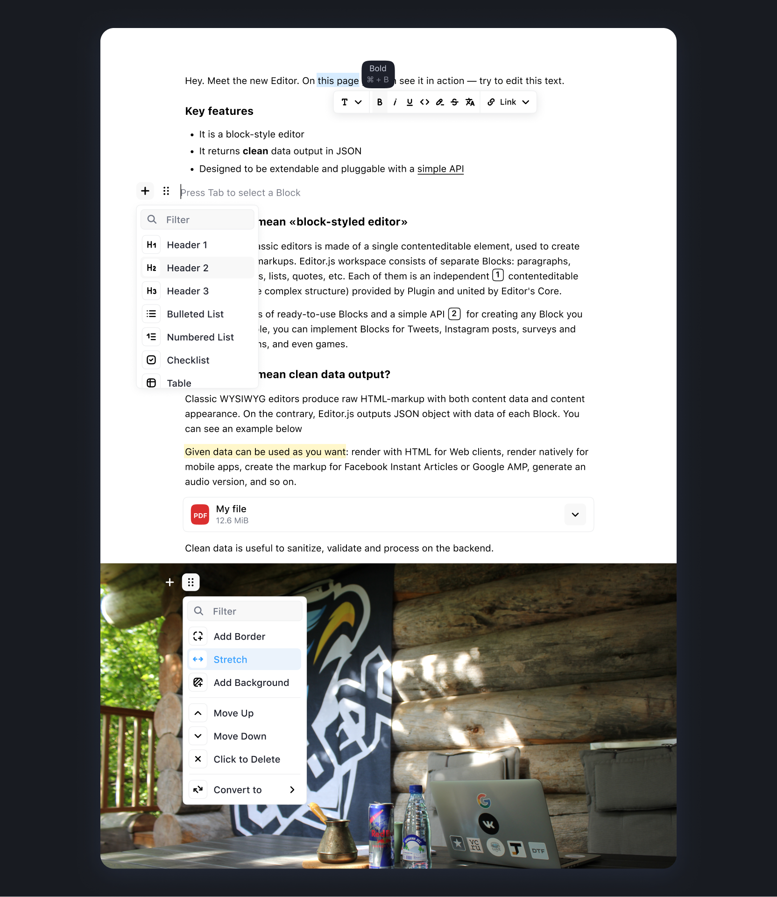

<p align="center">
  <picture>
    <source media="(prefers-color-scheme: dark)"  srcset="./assets/logo_night.png">
    <source media="(prefers-color-scheme: light)" srcset="./assets/logo_day.png">
    
  </picture>    
</p>


## About

Monkeys Editor is a fork of Monkeys Editor is an open-source text editor offering a variety of features to help users create and format content efficiently. It has a modern, block-style interface that allows users to easily add and arrange different types of content, such as text, images, lists, quotes, etc. Each Block is provided via a separate plugin making Monkeys Editor extremely flexible.

Monkeys Editor outputs a clean JSON data instead of heavy HTML markup. Use it in Web, iOS, Android, AMP, Instant Articles, speech readers, AI chatbots — everywhere. Easy to sanitize, extend and integrate with your logic. 

- 😍  Modern UI out of the box
- 💎  Clean JSON output
- ⚙️  Well-designed API
- 🛍  Various Tools available
- 💌  Free and open source

<picture>
  
</picture>   

## Installation

It's quite simple:

1. Install Monkeys Editor 
2. Install tools you need
3. Initialize Editor's instance

Install using NPM, Yarn, or [CDN](https://www.jsdelivr.com/package/npm/@monkeyseditor/monkeyseditor):

```bash
npm i @themonkeys/monkeys-editor
```

## Roadmap

- Unified Toolbars
  - [x] Block Tunes moved left
  - [x] Toolbox becomes vertical
  - [x] Ability to display several Toolbox buttons by the single Tool
  - [x] Block Tunes become vertical
  - [x] Block Tunes support nested menus
  - [x] Block Tunes support separators 
  - [x] Conversion Menu added to the Block Tunes
  - [x] Unified Toolbar supports hints 
  - [x] Conversion Toolbar uses Unified Toolbar
  - [x] Inline Toolbar uses Unified Toolbar
- Collaborative editing
  - [ ] Implement Inline Tools JSON format
  - [ ] Operations Observer, Executor, Manager, Transformer
  - [ ] Implement Undo/Redo Manager
  - [ ] Implement Tools API changes
  - [ ] Implement Server and communication
  - [ ] Update basic tools to fit the new API
- Other features
  - [ ] Blocks drag'n'drop
  - [ ] New cross-block selection
  - [ ] New cross-block caret moving
- Ecosystem improvements
  - [x] CodeX Icons — the way to unify all tools and core icons
  - [x] New Homepage and Docs
  - [x] @monkeyseditor/create-tool for Tools bootstrapping
  - [ ] Monkeys Editor DevTools — stand for core and tools development
  - [ ] Monkeys Editor Design System
  - [ ] Monkeys Editor Preset Env
  - [ ] Monkeys Editor ToolKit
  - [ ] New core bundle system
  - [ ] New documentation and guides

<br>

### Need something special?

Hire Monkeys experts to resolve technical challenges and match your product requirements. 

- Resolve a problem that has high value for you
- Implement a new feature required by your business
- Help with integration or tool development
- Provide any consultation

# About Monkeys


Monkeys is a team of digital specialists around the world interested in building high-quality open source products on a global market. We are open for people who want to constantly improve their skills and grow professionally with experiments in cutting-edge technologies.
